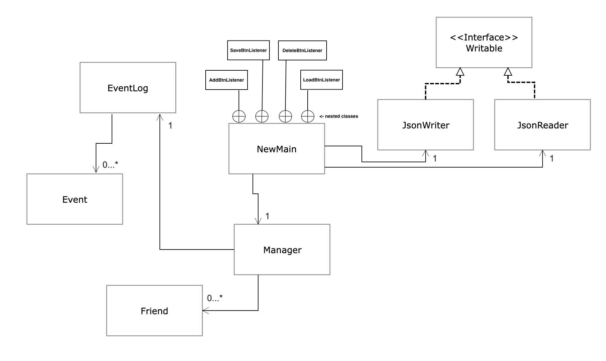

# Friend Debit App

# Phase 1

**What will the application do?**
## Keeps track of things friends bought for you or you bought for them in a debit system
With this app, whenever you buy things for your friends or they buy things for you. You will be able to keep track of how much you each "owe" each other through a debit system. If your friend buys you a coffee, you can subtract coffee debit. If you buy your friend a burrito, you can add burrito debit. (Negative means you "owe" them and positive means they "owe" you.) You can have different kinds of debit for different kinds of things. For example, paying for your friend's meal would be more expensive than buying them a coffee, so you can have a separate meal debit and coffee debit. You can also note each of your friends' preferences for each category of debit.

**Who will use it?**
- Friends
For example, if your friend is buying coffee or some drink for themselves but they also buy one and bring one back for you.
These kinds of situations happen often between close friends.

**Why is this project of interest to you?**
This app will make sure you don't have to ask your friend to Interac you back the money each time, which would firstly be a hassle and secondly be awkward. You can keep track of it through the app in a much more simple process. 
- sometimes it's awkward to always split money so exactly between close friends
- sometimes it's too much effort to keep track because of the number of times you buy things for each other

**User stories**
- As a user, I want to be able to add a person to the list of friends with debit
- As a user, I want to be able to create a new type of debit (e.g. bubble tea debit, burrito debit, meal debit, groceries debit)
- As a user, I want to be able to select a person and add / subtract any amount of debit (negative is you owe them, positive is they owe you)
- As a user, I want to be able to check how much debit there is for each person in each category of debit

These are stretch goals and other user stories:
- As a user, I want to be able to add a person's preferences for a specific type of debit (e.g. one friend likes the Double Chocolaty Chip Frappuccino from Starbucks, while another prefers Tim Hortons' Mint Chocolate Mocha)
- As a user, I want to be able to edit those preferences as well

# Phase 2

**User Stories**
- As a user, I want to have the option to SAVE my list of friends and their corresponding debit types and debit amounts to file 
- As a user, I want to have the option to LOAD my list of friends and their corresponding debit types and debit amounts to file 

# Phase 3
**Instructions For Grader**
- You can generate the first required action related to adding Xs (Friends) to a Y (Manager) by typing a name in the
  text field at the bottom of the page, and then pressing "Add". (Won't accept duplicates.)
- You can generate the second required action related to deleting Xs (Friends) from a Y (Manager) by selecting a name
  in the list of friends at the top of the page so that it's highlighted, then pressing "Delete".
- You can locate my visual component by looking in the bottom left corner of the page.
- You can save the state of my application by pressing the "Save" button in the bottom right.
- You can reload the state of my application by pressing the "Load" button in the bottom right corner of the page.

**Image Source**
Image source (pre-modification): https://www.flickr.com/photos/157270154@N05/26707092909
License:  Attribution-ShareAlike 2.0 Generic (CC BY-SA 2.0)
You are free to:
Share — copy and redistribute the material in any medium or format
Adapt — remix, transform, and build upon the material
for any purpose, even commercially. 

# Phase 4: Task 2
Sun Apr 02 21:50:03 PDT 2023
Added friend: bob
Sun Apr 02 21:50:03 PDT 2023
Loaded data from ./data/manager.json
Sun Apr 02 21:50:05 PDT 2023
Added friend: joe
Sun Apr 02 21:50:07 PDT 2023
Added friend: steve
Sun Apr 02 21:50:09 PDT 2023
Removed friend: steve
Sun Apr 02 21:50:11 PDT 2023
Saved data to "./data/manager.json

**UML Diagram**

*https://piazza.com/class/lci2wx0f1i74k2/post/1429
Wolfman said on Piazza "We haven’t discussed how to handle nested classes in UML class diagrams. So, we’re comfortable
with a good-faith effort on your part to describe their relationship with their containing class (and vice versa). Do
the best job you can and feel free to put a textual comment in the area to briefly explain what you have done."*
So I've just used what they suggested on Piazza and added a note.

**Refactoring**
Firstly, NewMain could be refactored to have a more specific name that better describes its purpose and function. 
NewMain doesn't really explain what goes on in the class. Secondly, it would be better to have JsonWriter and JsonReader
connect to the Manager instead of NewMain as it would make for better decoupling. Only the UI stuff should happen in
NewMain, however the JSON reading and writing is also happening there, when instead all the complicated stuff and data
handling should actually be happening in Manager. This would help keep the front end and back end separate, where each
handles their own thing.